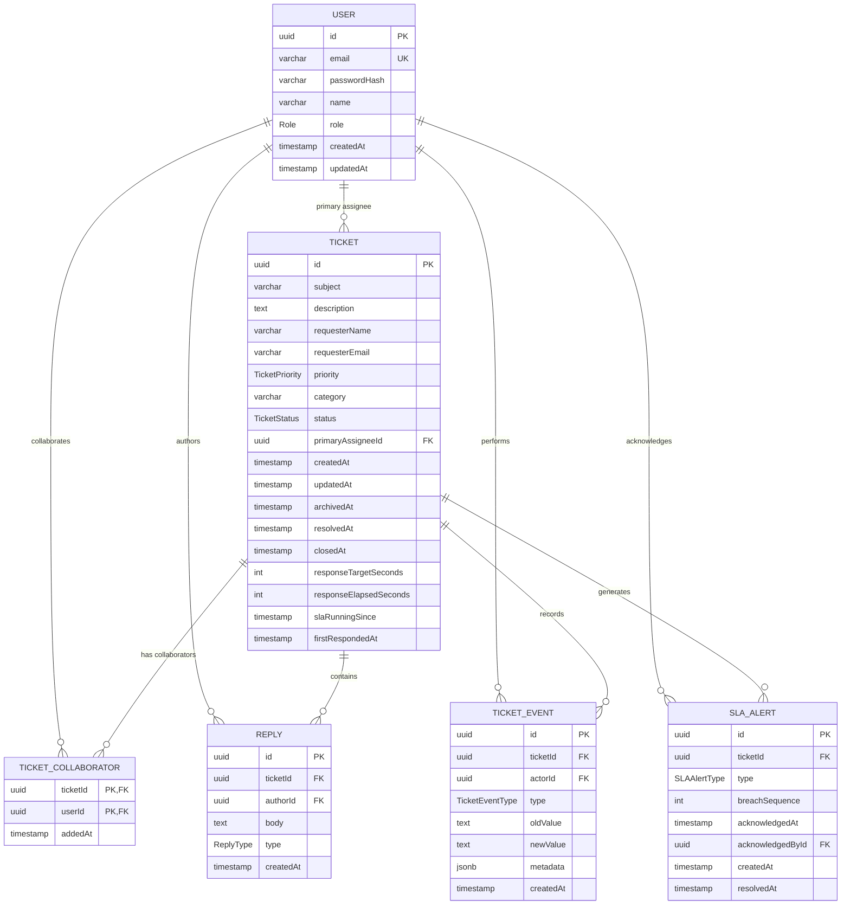

# Schema

## Entity Relationship Diagram

The application uses PostgreSQL with seven core tables. `Ticket` is the central entity. Users can be primary assignees, collaborators, reply authors, or actors responsible for ticket events. Replies and ticket events are append-only records used to preserve the conversation and immutable audit history.

### Relationship Summary

* One `USER` can be the primary assignee for many `TICKET` records.
* One `TICKET` has exactly one primary assignee.
* `USER` and `TICKET` have a many-to-many relationship through `TICKET_COLLABORATOR`.
* One `TICKET` can contain many `REPLY` records.
* One `USER` can author many `REPLY` records.
* One `TICKET` can have many immutable `TICKET_EVENT` records.
* One `USER` can be the actor for many `TICKET_EVENT` records.
* One `TICKET` can generate multiple `SLA_ALERT` records over its lifetime, allowing a later SLA breach to create a new alert after an earlier alert was acknowledged.
* One `USER` can acknowledge many `SLA_ALERT` records.

### Data Integrity Rules

The database is responsible for primary keys, foreign keys, unique email addresses, valid enum values, and preventing duplicate ticket-collaborator pairs. Application/service-layer logic is responsible for authorization, ticket lifecycle transitions, the closed-ticket reopening window, SLA calculations, alert acknowledgement permissions, and bulk-operation eligibility.

`REPLY` and `TICKET_EVENT` records are treated as immutable. They are never edited or deleted through the application.

Tickets are archived using `archivedAt` rather than moved to a separate archive table. This removes archived tickets from default queue queries while preserving their replies and audit history.

The SLA target is captured on the ticket as `responseTargetSeconds` when the ticket is created. This prevents later changes to SLA configuration from unexpectedly changing the target of existing tickets.

The response clock is represented using accumulated active time (`responseElapsedSeconds`) and the beginning of the current active segment (`slaRunningSince`). When a ticket enters `PENDING`, the active clock is stopped; when a customer reply moves it back to `OPEN`, the clock resumes. `firstRespondedAt` records the first customer-visible response.

The exact SLA target durations and the closed-ticket reopening window are application-level decisions rather than values specified by the assignment and will be documented separately in `docs/decisions.md`.

Answer each of these, in your own words.

- Table by table: what columns and types does each one have?
- Which relationships are one-to-many, and which are many-to-many?
- Which constraints are enforced by the database, and which by application code — and why did you draw the line there?
- What did you deliberately denormalise?
- What would break first if this had 100x the data?
