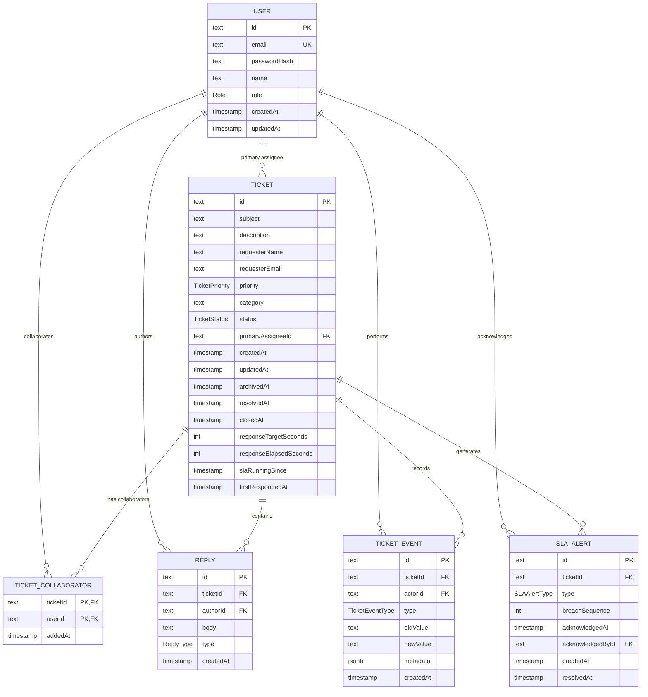

# Schema

## Entity Relationship Diagram

The application uses PostgreSQL with six Prisma models and core tables. `Ticket` is central. Users can be primary assignees, collaborators, reply authors, or actors responsible for ticket events. Replies and ticket events are append-only records used to preserve conversation and immutable audit history.

## Table by table: what columns and types does each one have?

The diagram lists every column. In Prisma terms, `String` fields are stored as PostgreSQL `TEXT` in the current migration, enum fields use PostgreSQL enums, `Int` fields use `INTEGER`, timestamps use `TIMESTAMP(3)`, and `metadata` uses `JSONB`. The six models are:

- **User:** identity, login credentials, display name, role, and timestamps. Its relations identify assigned tickets, collaborations, replies, ticket events, and acknowledged alerts.
- **Ticket:** subject/requester data, priority/category/status, assignee, lifecycle timestamps, and response-SLA tracking fields.
- **TicketCollaborator:** the ticket/user join table with a composite primary key and `addedAt` timestamp.
- **Reply:** immutable ticket message with author, body, visibility/type, and creation timestamp.
- **TicketEvent:** immutable audit record with optional actor, event type, optional old/new values, optional JSON metadata, and creation timestamp.
- **SLAAlert:** alert type and breach sequence for a ticket, acknowledgement fields, and creation/resolution timestamps.

## Which relationships are one-to-many, and which are many-to-many?

* One `USER` can be the primary assignee for many `TICKET` records; each ticket has one primary assignee.
* One `USER` can author many `REPLY` records, and one `TICKET` contains many replies.
* One `USER` can create many `TICKET_EVENT` records, and one `TICKET` has many immutable events. An event's actor is optional for system-generated events.
* One `USER` can acknowledge many `SLA_ALERT` records, and one `TICKET` can generate multiple alerts across breach sequences.
* `USER` and `TICKET` have a many-to-many relationship through `TICKET_COLLABORATOR`: a user can collaborate on many tickets and a ticket can have many collaborators.

## Which constraints are enforced by the database, and which by application code — and why?

The database enforces structural integrity: primary keys, required fields and nullability, foreign keys with `RESTRICT` deletes, the unique `User.email` index, PostgreSQL enum values, and the composite `TicketCollaborator(ticketId, userId)` primary key. It also enforces the unique `(ticketId, breachSequence, type)` constraint that prevents duplicate SLA alerts for one breach sequence. These rules remain true regardless of which API call or process writes the data.

Application services enforce context-dependent rules: ticket access for agents, supervisors, assignees, and collaborators; allowed lifecycle transitions; the seven-day closed-ticket reopening window; SLA elapsed-time and alert calculations; alert acknowledgement permissions; assignment and collaborator eligibility; bulk-operation eligibility; and the immutability convention for replies and ticket events. The database cannot determine these rules from row shape alone, so they belong in the service layer while authorization remains server-side.

`REPLY` and `TICKET_EVENT` records are treated as immutable. They are never edited or deleted through the application.

Tickets are archived using `archivedAt` rather than moved to a separate archive table. This removes archived tickets from default queue queries while preserving their replies and audit history.

The SLA target is captured on the ticket as `responseTargetSeconds` when the ticket is created. This prevents later changes to SLA configuration from unexpectedly changing the target of existing tickets.

The response clock is represented using accumulated active time (`responseElapsedSeconds`) and the beginning of the current active segment (`slaRunningSince`). When a ticket enters `PENDING`, the active clock is stopped; when a customer reply moves it back to `OPEN`, the clock resumes. `firstRespondedAt` records the first customer-visible response.

The exact SLA target durations and the closed-ticket reopening window are application-level decisions rather than values specified by the assignment and will be documented separately in `docs/decisions.md`.

## What did you deliberately denormalise?

There is no significant duplication of entity data. `Ticket.responseTargetSeconds` is a deliberate snapshot of the priority-based SLA target at ticket creation, so later configuration changes do not alter existing tickets. `responseElapsedSeconds` plus `slaRunningSince` is also an intentional compact representation of accumulated active response time and the current running segment; it avoids storing a row for every elapsed-time interval. These fields trade some recalculation complexity for simpler reads and stable historical behavior.

## What would break first if this had 100x the data?

The first pressure points would likely be the ticket queue's combined filtering, case-insensitive substring search over `subject` and `description`, sorting, and separate `findMany`/`count` queries. The current ordinary indexes help status, assignee, archive state, category, and sort columns, but they do not make arbitrary substring search fast; PostgreSQL full-text or trigram indexes would be a likely improvement. The SLA worker also scans all eligible active tickets every minute and evaluates them sequentially, so worker duration and database load would grow with the active queue; batching, leasing, or a dedicated job queue could address that later. Finally, ticket events and replies grow without bound per ticket, so timeline queries and storage would eventually need archival/partitioning or bounded pagination, while keeping the immutable history accessible.
